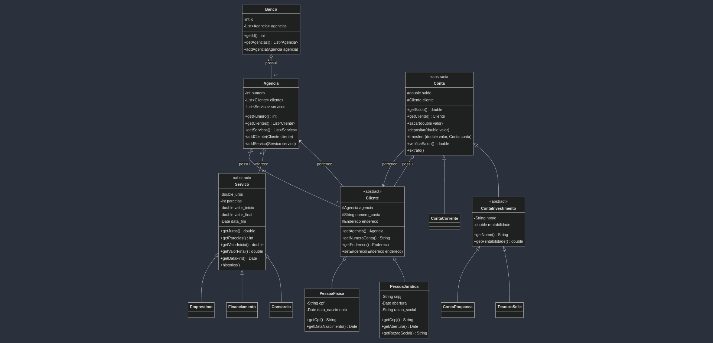

# Projeto: Simulação de Banco Digital

## Descrição

Este projeto foi desenvolvido para exercitar os conceitos de **Programação Orientada a Objetos (POO)**. Nele, foram criadas algumas classes que representam as operações de um **banco digital**, e no arquivo `Main`, uma mini simulação da aplicação foi realizada.

## Etapas do Projeto

1. **Rascunho das classes e suas abstrações**: As principais classes do sistema foram esboçadas, representando os componentes de um banco digital.
2. **Definição de atributos e métodos**: Foram estabelecidos os atributos e métodos necessários para cada classe, levando em consideração suas responsabilidades.
3. **Definição das agregações**: Determinamos as relações de agregação entre as classes para representar corretamente a composição do sistema.
4. **Geração do diagrama de classes**: Um diagrama de classes foi criado para visualizar a estrutura do sistema antes de codificá-lo.
5. **Desenvolvimento das classes**: As classes foram implementadas em código, seguindo o planejamento feito nas etapas anteriores.
6. **Simulação de interações**: No arquivo `Main`, foram criadas algumas interações para simular as operações de um banco digital em funcionamento.

Durante o desenvolvimento, apesar de o diagrama de classes ter sido crucial para a estrutura inicial do projeto, algumas mudanças surgiram à medida que o código foi implementado, o que é comum em projetos de POO.

Este projeto ajudou a aprofundar a compreensão dos conceitos de POO e como eles se aplicam na prática, como a abstração, encapsulamento, herança e polimorfismo.
---

---

# Project: Digital Bank Simulation

## Description

This project was developed to practice **Object-Oriented Programming (OOP)** concepts. It involves creating several classes to represent a **digital bank**, and the `Main` file includes a mini simulation of the application.

## Project Steps

1. **Sketching classes and their abstractions**: The main classes of the system were outlined, representing components of a digital bank.
2. **Defining attributes and methods**: Attributes and methods were defined for each class, considering their responsibilities.
3. **Setting up aggregations**: The aggregations between classes were established to properly represent the system's composition.
4. **Class diagram generation**: A class diagram was created to visualize the system's structure before coding.
5. **Class implementation**: The classes were implemented in code, following the plan made in the previous steps.
6. **Simulating interactions**: In the `Main` file, some interactions were created to simulate the operations of a functioning digital bank.

During development, although the class diagram was crucial for the initial structure of the project, some changes emerged as the code was implemented, which is common in OOP projects.

This project helped deepen the understanding of OOP concepts and how they work in practice, such as abstraction, encapsulation, inheritance, and polymorphism.
